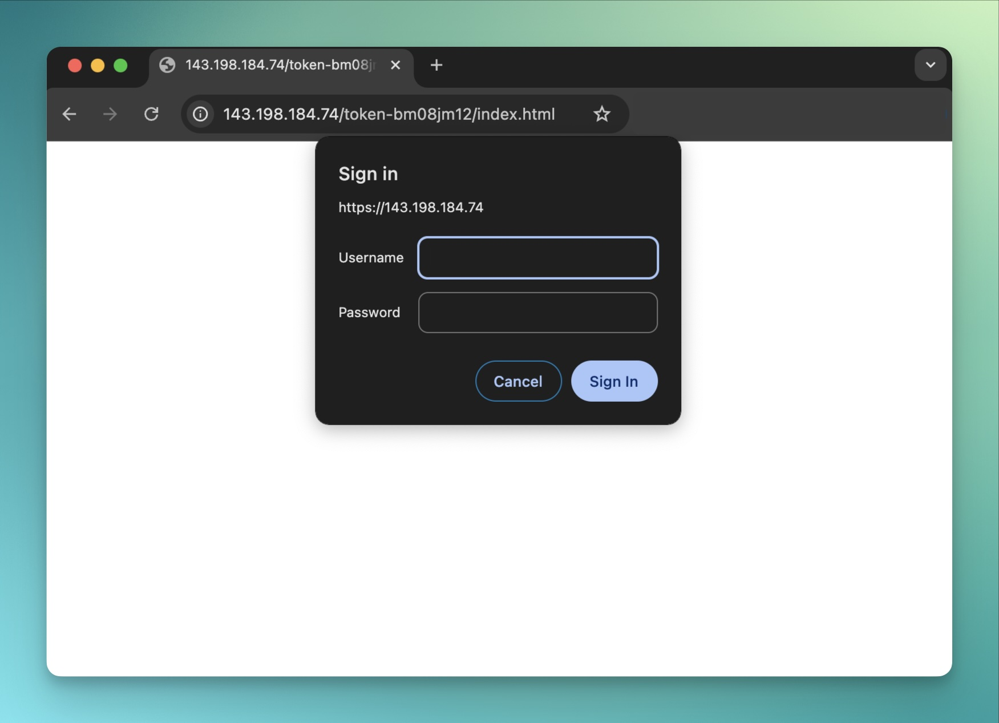

## TABLE OF CONTENTS
-----------------
- [Tutorial: Build A Secure Web Server](#tutorial-build-a-secure-web-server)
  - [Pre Reqs](#pre-reqs)
  - [Step 1: Set Up Your Server](#step-1-set-up-your-server)
  - [Step 2: Connect to Your Server](#step-2-connect-to-your-server)
  - [Step 3: Install Docker and Docker Compose](#step-3-install-docker-and-docker-compose)
  - [Step 4: Set Up Your Project Structure](#step-4-set-up-your-project-structure)
  - [Step 5: Dockerfile - Reverse Proxy](#step-5-dockerfile---reverse-proxy)
  - [Step 6: Dockerfile - Web Server](#step-6-dockerfile---web-server)
  - [Step 7: Create the Nginx Config](#step-7-create-the-nginx-config)
  - [Step 8: Create the Web Page](#step-8-create-the-web-page)
  - [Step 9: Generate a Self-Signed TLS Certificate](#step-9-generate-a-self-signed-tls-certificate)
  - [Step 10: Create the Docker Compose File](#step-10-create-the-docker-compose-file)
  - [Step 11: Build and Run the Containers](#step-11-build-and-run-the-containers)
  - [Step 12: Verify the Setup](#step-12-verify-the-setup)
  - [Step 13: Push to GitHub](#step-13-push-to-github)
  - [Step 14: Docker Down and Cleanup](#step-14-docker-down-and-cleanup)
  - [Deliverables](#deliverables)
      - [CONTAINERS](#containers)
      - [PORTS](#ports)
      - [PATH](#path)
  - [Conclusion](#conclusion)

# Tutorial: Build A Secure Web Server
[Gutsy](https://gutsy.com/) is all about security and solving the challenge of keeping sensitive content safe online. In this tutorial, we’ll build a secure web server with authentication and encryption and learn how to protect your own confidential data.



## Pre Reqs
In this tutorial you'll need:
1. [DigitalOcean](https://www.digitalocean.com/) account – to deploy your secure web server
2. [Docker](https://www.docker.com/) & Docker Compose installed – to containerize and run your app
3. [Linux commands](https://www.digitalocean.com/community/tutorials/linux-commands) – to communicate with your server
4. [Github](https://www.github.com/) account (optional) – to store and manage your code

## Step 1: Set Up Your Server
I'm using DigitalOcean, but you can use any cloud (AWS, Vultr, GCP, Equinix).

Here’s how I started:

1. Create a `DigitalOcean` account and log in
2. Create a new droplet with `Ubuntu 24.10` (or similar)
3. Choose a low-cost droplet (mine was $4/month)
4. Enable `SSH` and create an `SSH key pair`
5. Deploy the droplet and note the public IP address at `graphs > ipv4` inside of DigitalOcean


## Step 2: Connect to Your Server
Now that we're renting a server from DigitalOcean, we need to "talk" to it from our laptop. So I'll open up iTerm (other options are Windows PowerShell, VS Code's terminal, or Ghostty), and then `SSH` into the server.

Follow this format:
```sh
ssh root@$YOUR_SERVER_IP
```

> **Note:** My server's ipv4 is `143.198.184.74`, so I'll type `ssh root@143.198.184.74`

You should then see something like this:


## Step 3: Install Docker and Docker Compose
Before we dive in, let’s install Docker and Docker Compose. Docker lets us run our app in containers, and Docker Compose helps us manage multiple containers easily.

```sh
apt update && apt install -y docker.io
curl -L "https://github.com/docker/compose/releases/latest/download/docker-compose-$(uname -s)-$(uname -m)" -o /usr/local/bin/docker-compose
chmod +x /usr/local/bin/docker-compose
```

The `apt` installs the latest software packages.

The `chmod` gives us permission to execute the file.

Did it install successfully? Let's find out!

```sh
docker --version
docker-compose --version
```


LGTM.

## Step 4: Set Up Your Project Structure
Since we're doing everything in the command line, then we can't just right-click and choose "create file" or "create folder". So let's create a project directory and navigate into it by typing this into the server's terminal:

```sh
mkdir secure-web-app && cd secure-web-app
```

That creates a directory named `secure-web-app` and then goes into the folder (which currently has nothing inside of it).

Next, we'll create 3 directories inside that `secure-web-app` location:

```sh
mkdir proxy webserver proxy/certs
```

## Step 5: Dockerfile - Reverse Proxy
We'll need 2 Dockerfiles — one for the **proxy** and one for the **web server**. The proxy handles authentication and securely passes all requests to the web server. The web server simply serves the HTML.

First, create the `proxy` directory, navigate into it, and create a `Dockerfile` there:
```sh
mkdir proxy && cd proxy
touch Dockerfile
```

The `Dockerfile` is blank, so let's `nano` into it:
```sh
nano Dockerfile
```

You should see something like this:


Then we'll paste this into it:

```dockerfile
FROM nginx:latest

RUN apt-get update && apt-get install -y apache2-utils && rm -rf /var/lib/apt/lists/*

RUN echo 'admin:'$(openssl passwd -apr1 secret-passphrase) > /etc/nginx/.htpasswd

COPY nginx.conf /etc/nginx/nginx.conf
COPY certs/server.crt /etc/nginx/ssl/server.crt
COPY certs/server.key /etc/nginx/ssl/server.key

EXPOSE 443
CMD ["nginx", "-g", "daemon off;"]
```

Once you're done, save and exit by pressing:

- `CTRL` + `X` (to exit)
- `Y` (to confirm the changes)
- `Enter` (to save the file name and close)

## Step 6: Dockerfile - Web Server
Here's our 2nd `Dockerfile`!

Inside the `webserver` directory, create a file named `Dockerfile`:

```sh
touch Dockerfile
```

Same as before - the `Dockerfile` is blank, so let's `nano` into it:
```sh
nano Dockerfile
```

Then we'll paste this into it:

```dockerfile
FROM nginx:latest

COPY index.html /usr/share/nginx/html/token-bm08jm12/index.html

EXPOSE 80
CMD ["nginx", "-g", "daemon off;"]
```

Same as before - once you're done, save and exit by pressing:

- `CTRL` + `X` (to exit)
- `Y` (to confirm the changes)
- `Enter` (to save the file name and close)

Now our 2nd Dockerfile is ready! 

## Step 7: Create the Nginx Config
Inside the `proxy` directory, create a file named `nginx.conf`:

```nginx
events {}

http {
    server {
        listen 443 ssl;
        ssl_certificate /etc/nginx/ssl/server.crt;
        ssl_certificate_key /etc/nginx/ssl/server.key;

        location / {
            return 403;
        }

        location /token-bm08jm12/ {
            auth_basic "Restricted Content";
            auth_basic_user_file /etc/nginx/.htpasswd;
            proxy_pass http://webserver;
        }
    }

    server {
        listen 80;
        return 301 https://$host$request_uri;
    }
}
```
The `nginx.conf` file configures how Nginx handles requests, including routing, security (Gutsy loves security!), and performance settings.

The line `return 301 https://$host$request_uri;` is what does the redirect. Pretty cool!

## Step 8: Create the Web Page
This file can say anything you want. Inside the `webserver` directory, I'll create a file named `index.html`:

```sh
touch index.html
```

The `index.html` is blank, so let's add to it using `nano`:
```sh
nano index.html
```
Similar to what we did with the `Dockerfile` above, let's paste this into the file:

```html
<!DOCTYPE html>
<html lang="en">
<head>
    <meta charset="UTF-8">
    <meta name="viewport" content="width=device-width, initial-scale=1.0">
    <title>Gutsy 720° Vulnerability Management</title>
    <style>
        body {
            font-family: Arial, sans-serif;
            text-align: center;
            background-color: #1a1a2e;
            color: #e94560;
            padding: 50px;
        }
        h1 {
            font-size: 3em;
        }
        .highlight {
            color: #0f3460;
            background: #e94560;
            padding: 5px 10px;
            border-radius: 5px;
        }
        .cta {
            display: inline-block;
            margin-top: 20px;
            padding: 15px 25px;
            background: #0f3460;
            color: white;
            font-size: 1.2em;
            text-decoration: none;
            border-radius: 5px;
            transition: background 0.3s;
        }
        .cta:hover {
            background: #16213e;
        }
    </style>
</head>
<body>
    <h1><span class="highlight">Gutsy</span> 720° Vulnerability Management</h1>
    <p>Walt Ribeiro and Gutsy give you <strong>everything</strong> from detection to remediation</p>
    <br>
    <a target="_blank" href="https://gutsy.com/resources/events" class="cta">Learn About Gutsy Now</a>
    <br><br/>
    <center>
        <iframe width="560" height="315" src="https://www.youtube.com/embed/o0uIS8XL1gE?si=9SvbomSEkyQSSREx" 
            title="YouTube video player" frameborder="0" allow="accelerometer; autoplay; clipboard-write; 
            encrypted-media; gyroscope; picture-in-picture; web-share" 
            referrerpolicy="strict-origin-when-cross-origin" allowfullscreen>
        </iframe>
    </center>
</body>
</html>
```

You should see something like this:


This code has some CSS styling, a header, and an embedded [Youtube video about Gutsy](https://www.youtube.com/watch?v=o0uIS8XL1gE). Feel free to edit the HTML however you like! 

## Step 9: Generate a Self-Signed TLS Certificate
We're getting to the end. Now we'll just do the certificates, and then we'll be able to access our new secure (HTTPS) website hosted on DigitalOcean.

`cd` into the `proxy/certs` directory, and run this command to generate a self-signed certificate:

```sh
openssl req -x509 -nodes -days 365 -newkey rsa:2048 \
  -keyout proxy/certs/server.key -out proxy/certs/server.crt \
  -subj "/C=US/ST=State/L=City/O=Company/OU=Org/CN=localhost"
```

## Step 10: Create the Docker Compose File
Inside the project’s root directory, create `docker-compose.yml`:

```yaml
version: '3'

services:
  proxy:
    build: ./proxy
    ports:
      - "443:443"
    depends_on:
      - webserver

  webserver:
    build: ./webserver
    expose:
      - "80"
```

This file defines a simple multi-container application with two services:
- proxy
- webserver

The proxy listens on port 443 and the webserver runs on port 80. In practice, the proxy service forwards requests over to the webserver.

## Step 11: Build and Run the Containers
Run the following command to build and start the containers:

```sh
docker-compose up --build -d
```

This builds your app (if needed) and runs it in the background, so that you can keep working without keeping the terminal tied up.

> **Note:** If you edit any of your code (including the `index.html` page), you'll need to run this command again for the changes to take effect.


## Step 12: Verify the Setup
1. Open a browser and navigate to `https://$YOUR_SERVER_IP/token-bm08jm12/index.html`

When first visiting the server, you'll see this warning. Click on "`advanced > visit`".


Enter credentials:
  -  username: **admin**
  -  password: **secret-passphrase**

You should now see your webpage!


2. Now, let's check the 301 redirect. Ensure that HTTP (`http://$YOUR_SERVER_IP/token-bm08jm12/index.html`) redirects to HTTPS (`https://$YOUR_SERVER_IP/token-bm08jm12/index.html`)

3. Next, let's verify that invalid paths return a `403 Forbidden`. So type in a random URL like `https://$YOUR_SERVER_IP/whatever`

You should see something like this:


If those 3 steps pass, then you built the server correctly!

## Step 13: Push to GitHub
As mentioned in the pre-reqs above, this is optional. You can save your files locally, or use a hub like Github for collaboration and management.

Your tree directory for the file structure will look like this:
```
.
└── secret-web-app
     ├── docker-compose.yml
     ├── proxy
     │  ├── Dockerfile
     │  ├── certs
     │  │  ├── server.crt
     │  │  └── server.key
     │  └── nginx.conf
     └── web-server
          ├── Dockerfile
          └── index.html
```

## Step 14: Docker Down and Cleanup
To stop and remove the containers:

```sh
docker-compose down
```

> **Note:** Be sure to delete your DigitalOcean droplet after this tutorial. <br></br> 

## Deliverables
#### CONTAINERS
`secure-web-app-proxy`
- Line 5 is HTTPS
https://github.com/waltribeiro/gutsy/blob/6fb94c60402360c3ea8d34b10f244a32d98361d3/proxy/nginx.conf#L5

`secure-web-app`
- Line 13 hosts confidential content after authentication
https://github.com/waltribeiro/gutsy/blob/6fb94c60402360c3ea8d34b10f244a32d98361d3/proxy/nginx.conf#L13

#### PORTS
`80 (HTTP)`
- Line 21 redirects all traffic to HTTPS
https://github.com/waltribeiro/gutsy/blob/6fb94c60402360c3ea8d34b10f244a32d98361d3/proxy/nginx.conf#L21

`443 (HTTPS)`
- Line 5 handles secure connections via TLS
https://github.com/waltribeiro/gutsy/blob/6fb94c60402360c3ea8d34b10f244a32d98361d3/proxy/nginx.conf#L5

#### PATH
The path has 2 sections:
- IP Address `<your_server_ip>`
- Unique ID `<unique_id>`

`https://<your_server_ip>/token-<unique_id>/index.html`

## Conclusion
That's it! You just successfully deployed a secure web app using Docker, Nginx, and TLS authentication! If security is important to you, then [check out Gutsy](https://gutsy.com/)!

